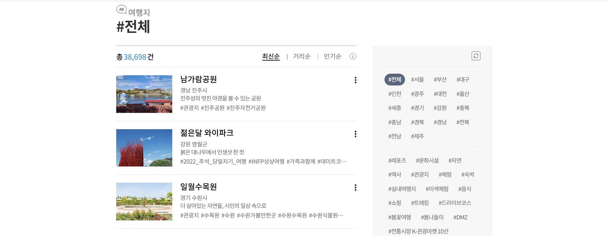
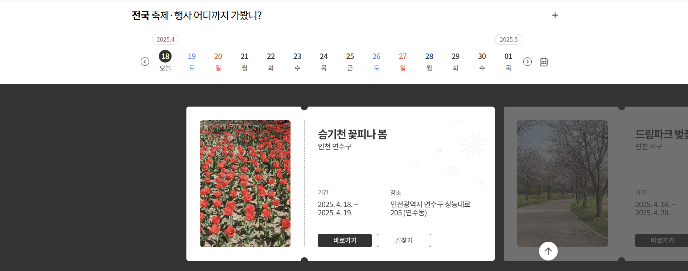

# 🇰🇷 대한민국 구석구석 클론코딩

[대한민국 구석구석](https://korean.visitkorea.or.kr/main/area.do) 웹사이트를 클론하여 제작한 프론트엔드 프로젝트입니다.
  
### 메인 페이지 주요 기능
- 자동 재생 및 일시정지 기능이 있는 메인 슬라이드 구현
- 좌우 이동 버튼과 터치/드래그 이벤트로 슬라이드 전환 가능
- 슬라이드 전환 시 텍스트와 이미지가 양쪽에서 동시에 분할 애니메이션으로 이동
- 현재 슬라이드 인덱스를 표시하는 슬라이드 인디케이터 및 프로그레스 바 포함
- 상세 설명 및 관련 이슈
    - [PR #15](https://github.com/Hararo-Dev-Assignment-team-1/hanaro-dev-assignment-1/pull/15)
  
  
### 지역 페이지 주요 기능
- 선택한 날짜를 기준으로 행사 데이터를 불러오는 달력 구현
- 불러온 행사 데이터를 표시하는 슬라이더 구현
- 하단의 양 쪽 이동 버튼 및 Dot 을 클릭하여 슬라이더 이동 가능
- 또는 클릭하여 옆으로 끌어서 이동 가능
- 상세 설명 및 관련 이슈
  - [PR #10](https://github.com/Hararo-Dev-Assignment-team-1/hanaro-dev-assignment-1/pull/10) / [PR #14](https://github.com/Hararo-Dev-Assignment-team-1/hanaro-dev-assignment-1/pull/14) / [PR #28](https://github.com/Hararo-Dev-Assignment-team-1/hanaro-dev-assignment-1/pull/28) / [PR #31](https://github.com/Hararo-Dev-Assignment-team-1/hanaro-dev-assignment-1/pull/31)


  
### 여행지 페이지 주요 기능
- 최신순, 거리순, 인기순으로 각각 정렬 기능
- 하단의 페이지네이션 기능을 통한 데이터 표시 조절
- 좌측 해시태그를 통한 필터링 및 필터링 초기화 기능 구현
- 상세 설명 및 관련 이슈
  - [PR #16](https://github.com/Hararo-Dev-Assignment-team-1/hanaro-dev-assignment-1/pull/16) / [PR #26](https://github.com/Hararo-Dev-Assignment-team-1/hanaro-dev-assignment-1/pull/26)


## 👥 팀원 소개
| 이름 | 역할 |
|------|------|
| 곽희건 | 프론트엔드 개발 |
| 김유림 | 프론트엔드 개발 |  


## 🛠 기술 스택
- **Frontend**: HTML5, CSS3, JavaScript  
- **Version Control**: Git & GitHub  


## 🔀 Git 브랜치 전략
- `main`: 최종 배포 브랜치  
- `develop`: 통합 개발 브랜치  
- `이슈번호-작업내용`: 기능 단위 브랜치 (이슈 기반 브랜치)  
  - 예시: `9-footer-개발` ← `#9 Footer 개발` 이슈 기반  


## 💡 Git 협업 컨벤션
- **이슈 생성**  
  - 형식:
    - Github Organization 의 Project 기능을 사용해 이슈 생성 및 관리
    - 주요 기능 및 Assignees, label(enhancement, bug 등 이슈 목적에 맞게) 지정
  - 예시:


- **브랜치 생성**  
  - 형식: `이슈번호-작업내용`  
  - 예시: `21-header-버튼-기능-구현`, `27-지역-페이지-슬라이더-드래그-이벤트`

- **커밋 메시지 규칙**  
  - 형식: `태그: 작업 내용` (콜론 뒤 한 칸 띄움)  
  - 예시: `feat: 여행지 페이지 필터링`

  주요 태그:
  - `feat`: 기능 추가  
  - `fix`: 버그 수정  
  - `style`: 스타일/레이아웃 수정  
  - `refactor`: 코드 리팩토링  
  - `docs`: 문서 수정  
  - `chore`: 설정, 환경 등 기타 작업

- **Pull Request 작성**  
  - 제목: 형식 제한 없음
  - 대상 브랜치: `develop`
  - 내용 :
    - 관련 이슈 번호
    - 주요 기능 및 각 기능 별 구현 방식, 진행 방향 등 설명
    - 필요 시 화면 스크린샷 추가
    - [bug] 관련 이슈일 경우 현상 발생 이유와 해결 방법 작성
  - Reviewer 지정 필수  
  - Self-Merge 금지  
  - 충돌 발생 시 작성자가 직접 해결
  - 예시 : [PR 작성 예시](https://github.com/Hararo-Dev-Assignment-team-1/hanaro-dev-assignment-1/pull/16)


## 📁 폴더 구조
```bash
📦project-root
 ┣ 📂css          # 스타일 파일
 ┣ 📂js           # 자바스크립트 파일
 ┣ 📂img          # 이미지 리소스
 ┣ 📂pages        # HTML 페이지
 ┣ 📜README.md
 ┣ 📜makeData.py
 ┗ 📜makeTravelData.js
